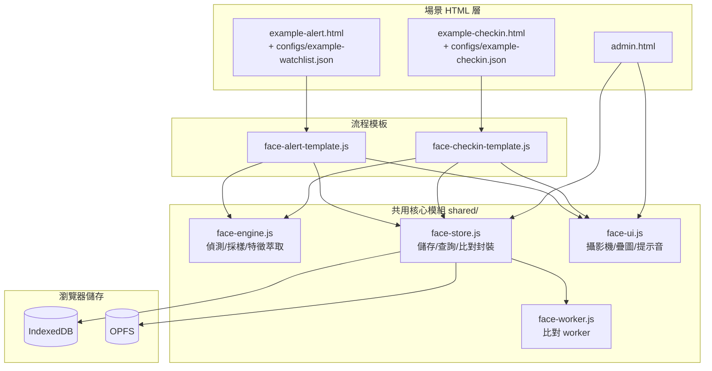

# 系統架構

完整設計規格見 [`../superpowers/specs/2026-05-23-facial-signature-design.md`](../superpowers/specs/2026-05-23-facial-signature-design.md)（§3 架構、§4 技術選型、§6 資料模型、§8 流程）。本檔是維護用的摘要。

## 分層

不同情境 = 不同 HTML，**不要把「依情境切換」當成單一頁面的設計選項**。新增情境就複製 example HTML + config，改 `scenarioId` / `scenarioName` / `watchlistId`。

## 模組職責（`shared/`）

| 模組 | 職責 | 不負責 |
|---|---|---|
| `face-engine.js` | 從 video 偵測臉、自適應採樣、萃取特徵向量、算 quality score、產生 snapshot blob | 儲存、UI |
| `face-store.js` | 人員 CRUD、event 寫入、watchlist、合併拆分、匯入匯出、tuning 讀寫；**封裝比對 worker 通訊** | camera/DOM／cosine 數學（委派 worker） |
| `face-ui.js` | 攝影機初始化、人臉框 + 進度條疊圖、完成動畫、TTS 招呼、警示彈窗、audio 解鎖 | 特徵向量數學 |
| `face-worker.js` | Web Worker 內跑 cosine similarity 全表掃描、回排序候選 | 任何 DOM/UI/持久化 |
| `face-checkin-template.js` | 模式 A 完整流程（config → 啟動引擎 → 接結果 → 寫 event → UI 反饋） | 特定場合邏輯 |
| `face-alert-template.js` | 模式 B 完整流程（載 watchlist → 比對命中 → 警示） | 特定場合邏輯 |

`admin.html` 不開鏡頭、不需 face-engine；其各 tab 拆在 `shared/admin/admin-tab-*.js`，主框是 `shared/admin/admin-shell.js`。純函式：時段排程解析 `shared/schedule-resolve.js`、B 表彙總 `shared/report-aggregate.js`。

## 關鍵介面語意

- `face-store.match()` 的 `decision ∈ {match, new, fuzzy}`，**永遠不回 `alert-hit`**。`alert-hit` 是 event 層判定：`face-alert-template` 收到 `match` 後才改寫 decision。讓 store 不需要知道「警示語意」。
- 警示模式預先 resolve `watchlist.personIds` 傳給 worker，只掃子集；簽到模式掃全表。
- 漸進式累積 + 污染防護：只有 `decision='match'` 才觸發向量回寫（見 spec §8.3，單一權威定義）。

## 資料模型

- **IndexedDB**（透過 `idb` 包裝）存結構化資料：person、event、watchlist、tuning、maintenance（schema 見 spec §6.1）。
- **OPFS** 存二進位 snapshot 圖檔，與 IDB 分離。
- 人臉特徵向量是**主鍵**，姓名／聯絡方式／關係都是後補的附加 metadata。
- 規模假設：單機構數百人（最多 ~1000，每人數十向量）。超過需引入 ANN（HNSW/IVF），不在 MVP。

## 技術選型重點

- 人臉辨識：`@vladmandic/human`（vendored 在 `vendor/human/`，離線可用）。
- 比對：Web Worker + `Transferable` Float32Array 零拷貝，主執行緒不卡。
- TTS：Web Speech API（注意 iOS PWA gesture 解鎖限制，見 [`operations.md`](operations.md)）。
- **無 build step**：純 ES modules，從 `vendor/` 本地 import。
