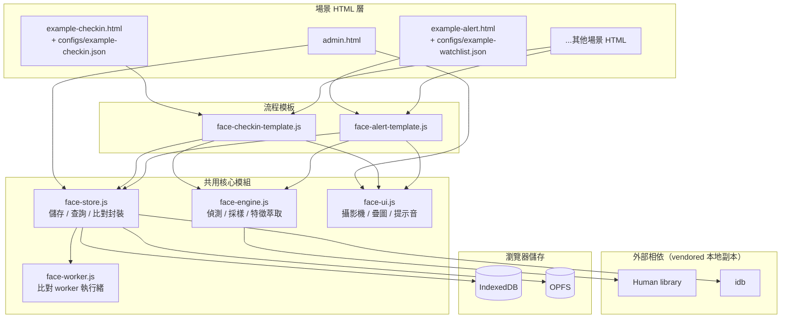
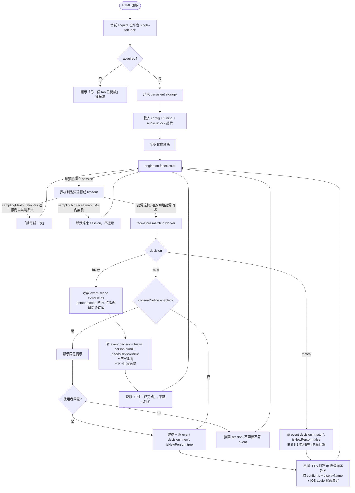

# Facial Signature 平台設計規格

**日期**：2026-05-23
**狀態**：草稿（待用戶 review）

---

## 1. 概述

### 1.1 背景與目標

純前端、資料留在瀏覽器的人臉識別簽到平台。**人臉特徵向量是主鍵**，姓名、聯絡方式、關係等都是後補的附加資訊。同一個人臉資料庫被多種獨立場景（HTML）共用。

### 1.2 核心情境（兩種模式）

整個平台只有兩種模式，所有 HTML 都是這兩種的變形：

- **模式 A：簽到** — 偵測到臉 → 識別/建檔 → 寫一筆 event（含場合、時間、附加 metadata）。
  - 涵蓋：長者每日報到、活動簽到、員工出勤打卡、訪客登記、課程點名、接送車輛報到、發藥核對等。差別只在「場合名稱 + 附加欄位 + UI」。
- **模式 B：警示** — 偵測到臉 → 比對指定的高風險名單 → 命中就主動跳警示。
  - 涵蓋：走失預警、黑名單監看。

### 1.3 非目標

- 不做後端 server、不做雲端同步、**不做多裝置同步**（無後端架構下永遠不會做，非「v2+ 待辦」）。
- 不依賴外部 API（除了首次載入辨識模型）。
- MVP 不做跨 tab 並行、不做多帳號權限分離、不做桌面 app 包裝。
- 不準備測試用人臉圖集，不做 E2E 自動化測試（攝影機硬體相依）。

### 1.4 設計者誠實聲明

- **本規格不寫任何沒有實測根據的具體數字**（採樣門檻、比對閾值、容量上限、時間參數、向量維度、模型大小等）。原因：沒有實測就估的數字會被誤讀為「設計決策」，導致實作者直接照抄略過校準。
- 所有可調參數設計為從 `tuning` 設定讀取，起始值在實作階段決定，由管理介面的校準工具於上線後逐步調整。
- 規格範圍：定義系統做什麼、怎麼解耦、有哪些校準與運維入口。不定義具體閾值與容量數字。

---

## 2. 核心概念與術語

| 術語 | 定義 |
|---|---|
| **特徵向量 (feature vector)** | 一張人臉經辨識模型萃取出的數值向量（具體維度由所選模型決定，實作時 query 一次） |
| **特徵庫 (vector set)** | 一個人累積的多個特徵向量集合，比對時對整個集合查詢 |
| **採樣 session** | 從攝影機畫面對一張臉持續萃取特徵向量的過程；採用「自適應停止」 — 收到足夠高品質 frame 即停 |
| **品質分數 (quality score)** | 對一個採到的 frame 是否「夠好」的綜合判斷；組成因子見 § 8.0 |
| **decision** | 比對結果的離散判定。合法組合（mode × decision）：<br/>• `mode='checkin'` × `'match'` / `'new'` / `'fuzzy'`<br/>• `mode='alert'` × `'alert-hit'`（命中 watchlist）/ `'fuzzy'`（warning 模式下模糊命中 watchlist） |
| **漸進式累積** | `decision='match'` 後，把新採到的高信心向量加入該人特徵庫；達上限時 FIFO 汰換最舊向量 |
| **污染防護** | 在 `decision='match'` 的前提下，**逐個新採向量過濾**：每個新向量 v 對該 person 既有 vectors 集合取最大 cosine similarity，≥ contaminationGuard 才回寫，避免錯認污染 |
| **場合 (scenario)** | 一個 HTML 對應一個場合（例如「日照中心日常報到」「2026 端午講座」）。場合定義在該 HTML 載入的 config JSON |
| **event** | 一次簽到、警示命中、或模糊待審的紀錄；含 personId（可為 null）、scenario、timestamp、decision、附加 metadata |
| **watchlist** | 警示名單；模式 B 的 HTML 監看的人員 id 集合 |
| **模糊區** | 比對相似度落在「明確 match」與「明確新人」之間的區域；MVP 統一處理：寫 event with `decision='fuzzy'` + `personId=null` + `needsReview=true`，**不**自動建檔，由管理員審後決定 |
| **模型版本 (modelVersion)** | 萃取該向量時使用的辨識模型標識；不同 modelVersion 的向量**不可互相比對** |

---

## 3. 整體架構



### 3.1 模組職責

| 模組 | 職責 | 不負責 |
|---|---|---|
| `face-engine.js` | 從 video 偵測臉、執行自適應採樣、萃取特徵向量、計算 quality score、產生 snapshot blob | 儲存、UI |
| `face-store.js` | 人員 CRUD、event 寫入、watchlist 管理、合併拆分、匯入匯出、tuning 參數讀寫；**封裝比對 worker 通訊** | video / camera / DOM / cosine similarity 數學運算（委派 face-worker） |
| `face-ui.js` | 攝影機初始化、人臉框 + 進度條疊圖、簽到完成動畫、TTS 招呼、警示彈窗、audio 解鎖 | 特徵向量數學 |
| `face-worker.js` | Web Worker 內執行 cosine similarity 全表掃描；接收 Float32Array transfer，回傳排序候選 | 任何 DOM / UI / 持久化 |
| `face-checkin-template.js` | 模式 A 完整流程（取 config → 啟動引擎 → 接結果 → 寫 event → UI 反饋） | 特定場合邏輯 |
| `face-alert-template.js` | 模式 B 完整流程（載 watchlist → 啟動引擎 → 比對命中 → 警示） | 特定場合邏輯 |

`admin.html` 不需 face-engine（合併拆分審查只看快照與既有 vectors）；§ 9.4 相似度測試器計算的是「對既有兩個 person 的 vectors 算 similarity」，不開鏡頭。

### 3.2 模組之間的介面（簡述，實作細節在 impl plan）

`face-engine.js` 使用 **callback / emitter 風格**支援多人並行（**不**使用 async iterator，避免 pull-based 序列化阻塞獨立 sessions）：

```js
const engine = await createFaceEngine({ videoElement, config, tuning });
engine.on('faceResult', (result) => {
  // result: { faceId, vectors, snapshot, qualityScore, modelVersion }
  // faceId 是該採樣 session 內穩定的 tracking id（用於並行多人）
});
engine.on('error', (err) => { ... });
engine.start();
engine.stop();
```

```js
face-store.match(vectors, modelVersion, { candidatePersonIds? })
// → { candidates: [{personId, similarity}, ...], decision, topSimilarity, matchScope }
// decision ∈ { 'match', 'new', 'fuzzy' }（**永遠不回 'alert-hit'**）
// 'alert-hit' 是 event 層的判定：face-alert-template 收到 'match' 後改寫 decision='alert-hit' 才呼叫 recordEvent
// 這層職責分工讓 face-store 不需知道「警示語意」
// candidatePersonIds 提供時，worker 只掃此子集（警示模式預先 resolve watchlist.personIds 傳入）
// 不提供時掃全表（簽到模式用）
// matchScope 由 face-store 依是否傳 candidatePersonIds 自動填入回傳結果
// **欄位命名統一**：events.matchSimilarity ⇔ match() 回傳的 topSimilarity（同一語義；event 寫入時 template 把 topSimilarity 對應到 matchSimilarity）
// 內部委派給 face-worker，主執行緒不阻塞

face-store.recordEvent({ personId, scenario, mode, snapshotBlob, meta,
                        decision, matchSimilarity, samplingQuality,
                        isNewPerson, needsReview, vectors, modelVersion })
// 寫一筆 event 並依規則寫入 OPFS snapshot
// 對 decision='match' 觸發污染防護後的向量回寫（見 § 8.3）
// 其他 decision（new / fuzzy / alert-hit）不觸發向量回寫

face-ui.showCheckinResult({ person, decision, tts, visualFallback })
// 若 tts 失敗 / 被靜音 / iOS gesture 未解鎖 → 自動切視覺備援
```

---

## 4. 技術選型

| 用途 | 選擇 | 理由 |
|---|---|---|
| 人臉辨識 | **@vladmandic/human**（vendored 本地副本） | 一個 import 完成 detection + landmarks + embedding；現代化、維護中、API 乾淨。本地 vendoring 確保離線可用、不被 CDN 故障影響 |
| 結構化儲存 | **IndexedDB**（透過 `idb` 套件包裝） | 標準瀏覽器 API；`idb` 提供 Promise 介面、體積小 |
| 二進位儲存 | **OPFS**（瀏覽器原生 API） | 與結構化資料分離；不污染 IDB；全主流瀏覽器支援 |
| TTS 語音 | **Web Speech API**（`speechSynthesis`） | 瀏覽器原生、零依賴、中英文皆可。注意 iOS PWA 限制（見 § 10） |
| 攝影機 | **getUserMedia** | 標準 API |
| 比對 worker | **Web Worker**（`face-worker.js`） | 主執行緒不卡頓；Float32Array 用 `Transferable` 零拷貝 |
| Build / 打包 | **無** — 純 ES modules，從 `vendor/` 本地 import | 跟「純前端」目標一致 |
| UI 框架 | **無** — vanilla JS + CSS；管理介面可以加 Alpine.js | 保持簡單 |
| PWA | **manifest.json + service worker（cache app shell + 模型）** | 達成「離線可用、加到主畫面變成 app」 |

**未來升級路徑**：若實測 Human library 準確率不足，`face-engine.js` 內部可以替換為 ONNX Runtime Web + ArcFace，**修改 `modelVersion` 標識**，舊向量視為「不可比對的歷史資料」（見 § 6.5 模型升級策略）。

---

## 5. 部署模型

⚠️ **重要限制**：`getUserMedia` 和 OPFS 都要求 **secure context**（`https://` 或 `http://localhost`）。`file://` 雙擊 HTML **無法使用攝影機**。

### 5.1 推薦部署方式：PWA + HTTPS 靜態託管

- 部署到 GitHub Pages / Netlify / Vercel（free tier 足夠）
- HTML 包含 `manifest.json`，使用者第一次連網開啟頁面後可以「加入主畫面」
- Service Worker cache app shell + Human library 模型，第二次以後**離線可用**
- 圖示點一下開啟，使用體感等同原生 app

### 5.2 替代部署方式

另可部署於機構內網（NAS / 樹莓派架簡易 HTTPS server），適用於不希望資料或流量出內網的場域。

### 5.3 Service Worker scope 與檔案結構

⚠️ Service Worker 預設只能控制其所在路徑之下的資源。GitHub Pages 等靜態託管平台**無法**設定 `Service-Worker-Allowed` HTTP header。因此：

- `service-worker.js` 與 `manifest.json` **放在根目錄**
- **所有場景 HTML 也放在根目錄**（不放 `scenarios/` 子目錄），確保 SW scope 完整覆蓋
- `shared/`、`configs/`、`vendor/` 等資源目錄不受 scope 影響，可任意組織

### 5.4 儲存持久性

瀏覽器預設可能會在「空間吃緊」或「長期未使用」時清除本網站的 IDB / OPFS 資料。對本系統而言這等於資料消失。

- 啟動時呼叫 `navigator.storage.persist()` 主動要求 persistent storage
- 若首次請求被拒絕，後續啟動可重複請求（瀏覽器自行決定）；管理介面提供手動觸發按鈕
- 管理介面顯示 `navigator.storage.persisted()` 當前狀態，未獲准時警告
- 對使用者而言，「**加到主畫面**」通常會提升 persistent storage 授權機率（iOS Safari、Chrome 等行為各異）；部署文件需強調此關聯

### 5.5 對使用者文件的要求

部署說明文件必須清楚說明：
- 為什麼不能 `file://` 雙擊
- 「加入主畫面」操作步驟（iOS / Android / Desktop 各一份）
- 「**加到主畫面後請首次啟動時允許 persistent storage**」操作步驟
- **第一次安裝後對相機設「永久允許」**的設定步驟
- 第一次連網安裝、之後離線使用的時序
- **部署方為個資控制者**的合規責任聲明（見 § 11）
- 實作完成後在 README 註明所選的 Human variant 與其檔案大小（量測後填入）

---

## 6. 資料模型

### 6.1 IndexedDB schemas

**設計原則**：events **不**直接持有 vectors 副本；vectors 僅存於 `people.vectors`。這代表拆分等運維操作無法從 event 還原當時的向量（影響見 § 9.1 拆分流程）。

```js
// store: people
{
  id: string,                  // 主鍵，ULID（時間序）
  displayName: string | null,  // first-class 欄位（UX 例外，見 § 6.4）
  vectors: Float32Array[],     // 漸進式累積；上限可調
                               // invariant: 同一 person 內所有 vectors 維度必須相同
                               //            且維度與 modelVersion 對應
                               // IDB 為 structured clone：寫回需整個 put，不可原地 mutate
  modelVersion: string,        // 萃取這些向量用的模型版本（見 § 6.5）
  meta: object,                // 動態 metadata（任意 key-value）
  createdAt: number,
  updatedAt: number,
}

// store: events
{
  id: string,                  // ULID
  personId: string | null,     // null = 模糊區 event（decision='fuzzy'），未指派至 person
                               // consent 拒絕時根本不寫 event，故 null 僅來自 fuzzy
  scenario: string,            // 場合 id (來自 config)
  mode: 'checkin' | 'alert',
  decision: 'match' | 'new' | 'fuzzy' | 'alert-hit',
                               // 唯一權威的判定欄位
                               // 合法 (mode, decision) 組合與**寫入當下**的不變量：
                               // ('checkin', 'match')     → personId 必存
                               // ('checkin', 'new')       → personId 必存（剛建檔）
                               // ('checkin', 'fuzzy')     → personId=null, needsReview=true
                               // ('alert',   'alert-hit') → personId 必存（命中 watchlist）
                               // ('alert',   'fuzzy')     → personId=null, needsReview=true, candidates 存於 meta
                               //
                               // **管理員審處後**的狀態（§ 9.2）：
                               // decision='fuzzy' event 經審處後 personId 可變非 null、needsReview 變 false
                               // decision 保留為 'fuzzy' 作為歷史判定標記
                               // 由 meta.reviewOutcome ∈ { 'assigned', 'created', 'ignored' } 區分結局
                               // 統計與篩選時：「未審 fuzzy」用 needsReview=true 篩，不要單靠 decision='fuzzy'
  timestamp: number,
  snapshotId: string | null,   // 對應 OPFS /snapshots/{snapshotId}.jpg；FIFO 汰換後可為 null
  meta: object,                // event-specific 附加
  matchSimilarity: number | null,
                               // 採統一規則：有 candidates 就填 top similarity，無 candidates 才為 null
                               // → decision='new' 完全無候選 → null
                               // → decision='new' 但有低於 newPersonThreshold 的候選 → top similarity
                               // → decision='match' / 'fuzzy' / 'alert-hit' → 命中 / top similarity
  matchScope: 'global' | 'watchlist',
                               // 比對範圍：mode='checkin' 為 'global'（全庫）；mode='alert' 為 'watchlist'（子集）
                               // 同一 similarity 數字在不同 scope 不可直接比較；統計時要分組
  samplingQuality: number,     // 此 session 的品質分數總評
  isNewPerson: boolean,        // 只對 decision='new' 為 true
  needsReview: boolean,        // decision='fuzzy' 時為 true；管理員指派後改為 false
                               // 拆分產生的 event 維持 false（拆分本身已是審處動作）
  modelVersion: string,        // 此 event 採樣時的模型版本
}

// store: watchlists
{
  id: string,
  name: string,
  personIds: string[],
  createdAt: number,
  updatedAt: number,
}

// store: settings  (單筆，固定 id="tuning")
{
  id: 'tuning',
  // 採樣相關
  samplingMinFrames: number,         // 採樣 session 至少要收到的高品質 frame 數
  samplingMaxDurationMs: number,     // 採樣 session 最長時間（毫秒）
  samplingNoFaceTimeoutMs: number,   // 連續無臉多久即結束 session（毫秒）
  samplingMinFaceSize: number,       // engine 層 pre-gate：小於此值的人臉**不啟動** sampling session
                                     // 與 § 8.0 quality factor faceSize 分工：
                                     // pre-gate 過了才進入 session，session 內每個 frame 再用 qualityFactorThresholds.faceSize 評分
  // 品質因子閾值（對應 § 8.0 因子；具體欄位由實作階段擴充，本 spec 列起始欄位）
  qualityFactorThresholds: object,   // 例：{ detectionConfidenceMin, poseAngleMax, blurScoreMin, ... }
  // 比對閾值
  matchThreshold: number,            // 視為同一人的最低 cosine similarity ∈ [0,1]
  newPersonThreshold: number,        // 低於此 cosine similarity 視為新人 ∈ [0,1]
  contaminationGuard: number,        // 向量回寫的最低 cosine similarity ∈ [0,1]
  // 容量
  vectorsPerPersonCap: number,       // 每人特徵庫上限
  snapshotsPerPersonCap: number,     // 每人 OPFS snapshot 上限
  // schema 版本
  schemaVersion: number,             // IDB schema 版本，啟動時做 migration check
  // (所有起始值由實作階段決定，本 spec 不寫數字)
}

// store: meta-stats  (單筆，固定 id="stats")
{
  id: 'stats',
  lastExportAt: number | null,       // 用於管理介面「上次匯出 N 天前」徽章
  // person / event 總數不快取在此 — admin 顯示時用 IDB count() 即時查（MVP 規模足夠快）
}
```

### 6.2 IndexedDB Indexes

- `events`: by `personId`, by `scenario`, by `timestamp`, by `needsReview`, by `mode`, by `decision`
- `people`: by `displayName`（管理介面搜尋；null 排在最後）
- `people`: by `modelVersion`（升級時快速掃舊版向量）
- **watchlist 反向查詢**（某 person 在哪些 watchlist 上）：MVP 採全表掃，資料量小可接受；v2+ 視需求加 reverse index 或在 people 加 `watchlistIds: string[]`
- **多條件複合查詢**（例如 `mode=alert AND scenario=X AND timestamp BETWEEN ...`）：MVP 規模下採「單 index 查詢 + in-memory filter」，不引入複合 index

### 6.3 OPFS 結構（flat snapshots）

```
/snapshots/
  {snapshotId}.jpg   ← ULID 命名；event 引用透過 snapshotId 串接
```

**為什麼用 flat 結構？**
- 合併 A → B 時：只需改 events 的 personId，**不必搬檔**
- 拆分 A → A + B 時：只需改部分 events 的 personId，**不必搬檔**
- person 與其 snapshots 的關聯**透過 events.snapshotId 串接**，不依賴目錄結構

**容量管理：**
- 「每人快照上限」靠 events 查詢實現：刪除 person 時掃出該 personId 的所有 events，把 snapshotId 收齊 → 刪 OPFS 檔
- 達到 snapshotsPerPersonCap 時 FIFO：找該 personId 最舊的 events，刪掉它們的 snapshotId 檔，events 本身保留但 snapshotId 設為 null（型別支援 nullable）
- **FIFO 以 events.personId 當前所屬為準**：拆分把 events 連同其 snapshot 檔的「所有權」整批移交給 B；之後 B 達 cap 觸發 FIFO 時，刪除的包含「從 A 拆過來的最舊 events」。管理員需理解：**拆分是不可逆的所有權轉移**，A 不再保有那些 snapshot

**孤兒檔回收（GC）：**
- 管理介面提供「掃描 orphan snapshots」工具：列出 OPFS 內存在但無任何 event 引用的 snapshotId，可一鍵刪除
- 用於修復刪除 / 匯入失敗時遺留的孤兒檔

### 6.4 動態 metadata 與 displayName 例外

- `people.meta` 與 `events.meta` 是**完全開放的 key-value 物件**
- 每個 HTML 的 config 自己定義想收什麼欄位
- 管理介面顯示時自動列出所有 keys（不預先綁定 schema）

**為什麼 `displayName` 被拉到 first-class 而非走 meta？**
這是 UX 妥協，明確標記為「動態 metadata 原則的例外」：
- 管理介面列表、搜尋、TTS 招呼都極高頻使用「姓名」
- 索引、空值排序、UI 顯示都需要該欄位的穩定存在
- 拉成 first-class 簡化實作；其餘所有欄位仍走 `meta`
- 未來若決定徹底純動態，遷移成本只是 admin UI 與 TTS template 改抽取路徑

### 6.5 模型升級策略

當辨識模型升級（例如 Human library 升級或換到 ArcFace）時：

- **新舊模型的向量無法互相比對**（維度不同 / embedding space 不同）
- **不自動升級**：spec 明確不嘗試「重新計算舊向量」（沒有原始臉部資料只有向量，數學上做不到）
- **採取「新 person、舊 person 凍結」策略**（單一 modelVersion 欄位、實作簡單）：
  - 升級後，新採樣的 vectors 標記 `modelVersion = 'v2'`
  - 舊 person 的 vectors 標記 `modelVersion = 'v1'`，**不再用於比對**（face-worker 啟動時依當前 modelVersion 過濾比對範圍）
  - 該人下次入鏡時被視為新人 → 自動建立**新的 person record**（modelVersion='v2'）
  - 管理介面提供「**v1 → v2 合併**」入口：管理員看到「這個 v2 新人」其實是「那個 v1 舊人」時，按合併
    - **合併語意**：events 全部改 personId 指向新 v2 person；舊 v1 person 標為刪除；**舊 v1 vectors 直接丟棄**（不加入 v2，因維度 / embedding space 不同）
    - events 自身的歷史連續性**由 events.modelVersion 保留**（歷史 event 仍標 v1，可在管理介面查得到）
  - 完成全庫遷移後（沒有 modelVersion='v1' 的 person），可清理 v1 殘留

### 6.6 規模與效能設計目標

- 設計時假設**單一機構規模 ~ 數百人**（最多 ~1000 人，每人最多數十向量）
- 全表 cosine similarity 掃描放在 Web Worker（`face-worker.js`），主執行緒不卡
- 超出此規模需引入近似最近鄰（HNSW / IVF）— 不在 MVP 範圍
- OPFS 全庫圖檔總量靠**每人快照上限**間接控制，無全庫硬上限（管理介面顯示 quota 並警告）

---

## 7. HTML 與 config 結構

### 7.1 檔案組織

```
/
  example-checkin.html        ← 簽到示範
  example-alert.html          ← 警示示範
  admin.html                  ← 管理介面
  (其他場景 HTML，使用者自己複製範例修改)

  manifest.json
  service-worker.js

  configs/
    example-checkin.json
    example-watchlist.json
    (其他 config，跟 HTML 一對一)

  shared/
    face-engine.js
    face-store.js
    face-ui.js
    face-worker.js
    face-checkin-template.js
    face-alert-template.js

  vendor/
    (Human library 本地副本 + idb 本地副本)
```

⚠️ **所有場景 HTML 必須放在根目錄**，原因見 § 5.3 service worker scope。

### 7.2 場景 HTML 的形態

每個場景 HTML 是極輕的入口，**config 路徑寫死在 HTML 內**：

```html
<!doctype html>
<html><body>
  <div id="app"></div>
  <script type="module">
    import config from './configs/example-checkin.json' with { type: 'json' };
    import { runCheckin } from './shared/face-checkin-template.js';
    runCheckin(config, document.getElementById('app'));
  </script>
</body></html>
```

**設計原則**：URL 上不帶 `?config=` 參數。一個 HTML 對應一個場合，從檔名一望即知；改 config 不用改 HTML，改 HTML 不用改 config。

### 7.3 Config JSON schema（簽到模式）

```json
{
  "scenarioId": "...",
  "scenarioName": "...",
  "uiTheme": { "primary": "...", "accent": "...", "background": "..." },
  "trigger": "auto" | "manual",
  "manualUi": {                         // 僅 trigger=manual 時讀取
    "buttonLabel": "...",               // 例如「開始簽到」
    "countdownSec": number | null       // null = 立即；非 null = 倒數
  },
  "concurrency": "single-roi" | "multi-face",
  "dedupWindowMs": number,
                                        // 為何放 config 不放 tuning：
                                        // 不同場景的「去重」語意差異大
                                        // 例如「員工打卡」希望短窗（避免漏記），「活動簽到」可長窗
                                        // 屬於場景產品決策而非全局校準參數
  "consentNotice": {                    // 新人建檔前提示（合規用）
    "enabled": boolean,
    "message": "...",
    "requireExplicitConsent": boolean
                                        // true  = 必須勾選「我同意」box 才能繼續建檔
                                        // false = 純顯示告知文字，按「繼續」即建檔（無勾選 UI）
  },
  "extraFields": [
    {
      "key": "...",
      "label": "...",
      "type": "bool" | "text" | "select",
      "options": [...],                 // 僅 type=select
      "scope": "person" | "event",      // 寫入 person.meta 還是 event.meta
      "collectOn": "newPersonOnly" | "firstTimeAtScenario" | "every",
                                        // newPersonOnly        = 僅 decision='new' 時詢問
                                        // firstTimeAtScenario  = events 內無此 (personId, scenario) 配對時詢問
                                        // every                = 每次都詢問
      "required": boolean               // true=未填則 session 中止不寫 event
                                        // false=提供「跳過」按鈕，按了就寫 event 但 key 留空
    }
  ],
  "tts": {
    "enabled": boolean,
    "templateNamed": "...{name}..."     // {name} = person.displayName
                                        // 無 displayName 時不播 TTS（依用戶需求），改視覺反饋
                                        // MVP 不提供「無名也播」選項
  }
}
```

**模糊區處理：MVP 統一行為**（**不**在 config 提供切換選項）：寫 event with `decision='fuzzy'`、`personId=null`、`needsReview=true`，**不**自動建檔。UI 顯示「已完成」即可，管理員到 events tab 審後決定指派至某 person 或建檔。

**trigger 行為：**
- `auto`：頁面開啟即偵測，臉進入畫面即啟動採樣 session
- `manual`：UI 顯示 `manualUi.buttonLabel` 按鈕；按下後（可選倒數）才開始偵測，達標後回到 idle 等下次按
- `manual + multi-face` 組合：按鈕按下後對當下畫面中**所有**臉並行採樣，全部完成或超時後回 idle
- `auto + single-roi` 組合：自動偵測但只處理中央 ROI 框內最大的臉

### 7.4 Config JSON schema（警示模式）

```json
{
  "scenarioId": "...",
  "scenarioName": "...",
  "uiTheme": { ... },
  "watchlistId": "...",
  "concurrency": "single-roi" | "multi-face",
  "dedupWindowMs": number,
                                        // 命中同一 personId 在窗內不重複跳警示、不重複寫 event
                                        // 與簽到 dedupWindowMs 同樣放 config（場景差異大）
  "alertSound": {
    "url": "...",
    "mode": "once" | "repeat",
    "repeatUntilDismissed": boolean
  },
  "alertMessage": "..."
}
```

---

## 8. 流程描述

### 8.0 品質分數構成因子

採樣 session 是否「足夠」由 **quality score** 決定。本 spec 列出組成因子，但**不寫加權與閾值**（由實作 + 校準決定）：

| 因子 | 含義 | 來源 |
|---|---|---|
| `detectionConfidence` | Human library 對該臉的偵測信心度 | Human face.score |
| `faceSize` | 臉框邊長（像素），相對於畫面大小 | bbox 計算 |
| `poseAngle` | 偏離正面的角度（yaw / pitch / roll） | Human pose / landmarks |
| `blurScore` | 影像模糊度（laplacian variance 之類） | snapshot canvas 計算 |
| `landmarksCompleteness` | 關鍵點偵測完整度（有些角度看不到全部點） | Human landmarks |
| `interFrameConsistency` | 同一 session 內多個 vectors 之間的內部相似度（**越穩越好**）；需 session 內已有 ≥1 個歷史 vector 才生效，第一個 frame 此因子自動視為通過 | 即時計算 |

**達標條件**：每個因子有獨立閾值（存於 `tuning.qualityFactorThresholds`），全部因子皆達標的 frame 才算「高品質 frame」；session 達標條件 = 收集到至少 `samplingMinFrames` 個高品質 frame 且未超過 `samplingMaxDurationMs`。**具體閾值欄位由實作階段擴充，本 spec 僅列因子。**

### 8.1 簽到模式流程



**關鍵設計：**
- **平台級單 tab 鎖**：用 `navigator.locks.request('facial-signature-tab', ...)` 申請；其他任何 facial-signature 頁面（不限同 HTML）已開時，後開的進唯讀提示。若 `navigator.locks` 不支援則 fallback 到 `BroadcastChannel` 廣播 token。
- **多人並行**（`concurrency: multi-face`）：engine 對每張偵測到的臉維持獨立 sampling session，採樣 / 比對 / 寫 event 各自進行，互不阻塞
- **單人 ROI**（`concurrency: single-roi`）：畫面中央畫框，只處理框內最大的臉，其他偵測到的臉忽略
- **去重節流**：同一 personId 在 `dedupWindowMs` 內不重複寫 event 與不重複觸發向量回寫；模式 B 警示也適用。**dedup 命中時：跳過 event 寫入與向量回寫，但仍給使用者中性視覺反饋（避免使用者反覆嘗試）**。檢查點在 match decision 判定後、recordEvent 前；對 `decision='fuzzy'`（personId=null）不適用 dedup（無法依 personId 去重）
- **初始品質門檻**：新建檔時也檢查 session 的 samplingQuality（非僅 contaminationGuard），不通過則 retry，避免低品質初始向量帶歪後續比對
- **模糊區不建檔**：寫 event 但不建 person，意味著管理員審處前該筆 event 不會被誤計入任何人的歷史；同時也避開了「fuzzy 自動建檔卻繞過 consent」的合規問題
- **附加欄位收集**：在 decision 判定後、Feedback 之前插入收集 UI
  - 依 `collectOn` 決定是否要詢問該欄位：
    - `newPersonOnly`：僅 `decision='new'` 時
    - `firstTimeAtScenario`：events 內無 `(personId, scenario)` 配對時（用 events 雙欄位查詢）
    - `every`：每次（含 match / new）
  - 收集到的值依 `scope` 寫入：`scope='person'` 寫到 person.meta、`scope='event'` 寫到 event.meta
  - **`decision='fuzzy'` 時**：因 personId=null，**只收集** `scope='event'` 欄位（person-scope 略過，待管理員指派時若該人已有此 key 就保留，否則由管理員手動補）；`collectOn` 對 fuzzy 不適用，所有 event-scope 欄位都嘗試收集
  - `required=true` 但跳過 → 中止此次 session 不寫 event；`required=false` 跳過 → 寫 event 但該 key 留空
- **TTS 與視覺備援**：
  - 若 `tts.enabled` 且 `person.displayName` 存在 → 嘗試 `speechSynthesis.speak`
  - 若 `displayName` 為 null（剛建檔的新人 / 模糊區）→ **不**播 TTS，僅顯示中性視覺反饋（例如「歡迎光臨 ✓」動畫，**不**嘗試顯示姓名）
  - 若 iOS audio context 未解鎖（有 displayName 但無 user gesture 解鎖紀錄）→ fallback 顯示大字「{name}」 + 視覺動畫
  - HTML 開啟時，第一次互動（任何 tap）會解鎖 audio context，之後 TTS 才可自動播

### 8.2 警示模式流程

```mermaid
flowchart TB
    Start([HTML 開啟]) --> Lock[嘗試 acquire 全平台 single-tab lock]
    Lock --> LockOk{acquired?}
    LockOk -->|否| ReadOnly[顯示「另一個 tab 已開啟」進唯讀<br/>不啟動攝影機、不寫 event、不跳警示]
    LockOk -->|是| Persist[請求 persistent storage]
    Persist --> Load[載入指定 watchlist 與名單上每人的向量]
    Load --> Det[engine.on faceResult]
    Det -->|每張臉獨立 session, 依 concurrency 設定| Samp[採樣]
    Samp --> Match[face-store.match 限 candidatePersonIds=watchlist]
    Match --> D{decision}
    D -->|match| Hit[彈警示彈窗 + 警示音<br/>寫 event decision='alert-hit', mode=alert<br/>**不**回寫向量]
    D -->|fuzzy| FuzzyHit[彈警示彈窗 + 警示音<br/>寫 event decision='fuzzy', mode=alert, personId=null, needsReview=true<br/>event.meta.candidates = [-personId, similarity-, ...] 沿用 match 回傳結構<br/>**不**回寫向量]
    D -->|new| Det
    Hit --> Wait[等管理員確認/關閉]
    FuzzyHit --> Wait
    Wait --> Det
```

**關鍵設計：**
- **比對範圍縮限**：傳 `candidatePersonIds=watchlist.personIds` 給 face-store.match，worker 只掃此子集
- **不為一般人寫 event**（單純監看，decision='new' 即捨棄）
- **警示命中 event 不觸發向量回寫**
- **fuzzy 一律保守觸發警示**：走失預警、黑名單等場景「漏報」比「誤報」風險高；fuzzy event 同時跳警示與標 needsReview，管理員到 § 9.2 Events tab 審處（採此設計簡單一致，不再做場景切換）
- 警示音「響一次」或「持續響到確認」由 config 控制
- 多人入鏡依 `concurrency` 設定處理

### 8.3 漸進式累積與污染防護（單一定義權威來源）

**觸發時機**：以下兩處皆觸發此規則：
1. **簽到流程命中（自動）**：`mode='checkin'` 且 `decision='match'` 後立即套用，把當次 session 採到的新 vectors 寫入 person.vectors
2. **管理員「合併 A → B」（手動運維）**：把 A 既有的 vectors 套同樣過濾規則加入 B（A 是來源向量集，B 是目標 person）

**不觸發污染防護過濾的情境**：alert / fuzzy / 拆分 / 匯入 / v1→v2 升級合併

**`decision='new'` 的特殊處理（新人建檔）**：
- **不**套用 § 8.3 過濾規則（沒有基準向量可比對）
- 把當次 session 的**所有採樣 vectors 全部寫入** person.vectors，受 vectorsPerPersonCap 限制（若採樣量超過上限取最新的 FIFO 保留）
- 已通過 § 8.1 的「初始品質門檻」確保這批 vectors 不至於太爛
- 沒有這個特殊處理會導致致命錯誤：新人 vectors 永遠空、下次入鏡又被當新人，無限循環

**逐向量過濾規則**：

對於每個來源向量 `v_new`（不論來自 session 或合併來源）：
1. **若目標 person.vectors 為空**：直接接受 `v_new`（無基準可比；同 `decision='new'` 的特殊處理）。常見場景：剛拆分產出的 B、剛從 fuzzy 指派建立的新 person、外部匯入後重建的目標
2. 否則計算 `v_new` 對目標 person 既有 vectors 集合內**每個向量的 cosine similarity**，取**最大值** `s_max`
3. 若 `s_max ≥ contaminationGuard`，則接受 `v_new` 加入目標 person.vectors；否則丟棄
4. 若加入後超過 `vectorsPerPersonCap`，FIFO 汰換最舊的向量

**為何要 empty-target fallback**：§ 9.1 拆分功能的官方建議補救路徑是「拆分 → B 重複建檔 → 合併」；若 § 8.3 對 vectors=[] 的 B 套規則會把所有來源向量丟棄，此補救路徑形同失效。

**為何採用「最大值」而非平均**：人臉在不同角度 / 表情下會有「相對最像的歷史向量」，用最大值能正確捕捉「這個新向量跟既有庫中至少一個視角接近」，避免被姿態差異多的人錯誤過濾。

---

## 9. 管理介面 (admin.html)

四個 tab：

### 9.1 人員 tab

- 列表：快照（最新一張） + displayName + 最後活動時間 + meta 預覽 + modelVersion 標籤（v1/v2 共存期間用）
- **未命名 filter**：篩出 `displayName === null` 的人員，提供行內快速命名 input（核心日常運維操作）
- **modelVersion filter**：升級過渡期可篩出舊版向量人員
- 列表行內可編輯 displayName 與 meta（meta 用 JSON editor 或 key-value 列）
**對 watchlists 的連動規則**（所有刪除 / 合併操作都需處理，與其他變更同一 IDB transaction 內執行）：
- **刪除 person P**：從所有 `watchlists.personIds` 移除 `P`
- **合併 A → B**：所有 `watchlists.personIds` 中的 `A` 替換為 `B`；若 `B` 已在同 watchlist，去重；更新 `updatedAt`

- 操作：
  - **刪除**：移除 person + 該人所有 events + 該人所有 events 引用的 OPFS snapshot 檔 + 從相關 watchlists 移除（流程見 § 10 失敗處理）
  - **合併 A → B**：
    - A 的 vectors **依 § 8.3 過濾規則**加入 B（受 vectorsPerPersonCap 限制，FIFO）
    - A 的 events 全部改 personId = B
    - 所有 watchlists 中的 A id 替換為 B id（去重）
    - A 標為刪除（不立即刪 OPFS，因 events 已轉移仍引用同樣的 snapshotId）
    - **不**搬 OPFS 檔（flat 結構，永遠由 events.snapshotId 引用）
  - **拆分 A → A + B**（**MVP 已知限制**：vectors 不分配給 B）：
    - 管理員從 A 的歷史 events 列表（含 snapshot 縮圖）勾選「要拆出去」的 events 子集
    - 系統建立新 person B（displayName=null、vectors=[]）
    - 勾選的 events 改 personId = B
    - **A 的 vectors 保留在 A，完全不動**（因 events 不持有向量副本，無法從 event 還原拆分當時的向量）
    - **B 的 vectors 從空開始**；下次 B 對應的人入鏡時被視為 `decision='new'` 的新人，會建立**另一個 person**（重複建檔）。管理員再做一次合併把該新 person 與 B 合併，由 § 8.3 累積機制把新向量補入 B 的 vectors。**這是 MVP 已知限制**（v2+ 會在拆分指派時順便補入 vectors，見 § 13.2）
    - 拆分後的 events 維持 `needsReview=false`（拆分本身已是管理員審處動作）
  - **v1 → v2 合併**（升級過渡期）：UI 入口與一般合併相同，但**內部處理依 § 6.5**：舊 v1 vectors 直接丟棄、不加入 B；events 改指向 v2 person；watchlists 中的舊 id 一併替換為新 v2 person id（同合併規則）。UI 提示文案標示「跨模型版本合併」

- 搜尋：依 displayName / meta keyword（meta 全文搜）

### 9.2 Events tab

- 時間軸列表，可依 **scenario / personId / mode / decision / 時間區間 / needsReview** 篩
- mode + decision 雙重篩選可細查：警示命中需同時篩 `mode='alert' AND decision='alert-hit'`；`mode='alert'` 下另有 `decision='fuzzy'` 為模糊警示，預設不混入命中清單
- **未審模糊區** = `decision='fuzzy' AND needsReview=true AND personId=null`；管理員 filter 應使用 `needsReview=true` 來找待審項（單用 `decision='fuzzy'` 會包含已審完的歷史 fuzzy event，因為審處後 decision 保留為 'fuzzy' 作為歷史判定標記）
- 未審模糊區獨立明顯欄位，逐筆審處：
  - 「**指派至既有 person**」→ 搜尋並選擇 person → 設定 event.personId、`needsReview=false`、`decision` 維持 `'fuzzy'`（**保留歷史 decision，方便事後分析誤判率**）、`meta.reviewOutcome='assigned'`
    - 注意：MVP **不**把該次採樣的 vectors 補入 person.vectors（event 不存 vectors，無法事後補）；列入 v2+
  - 「**建立新 person**」→ 跳出 displayName 與 meta 輸入 + 「請確認當事人已知悉並同意建檔」勾選 → 建檔，event.personId 指向新 person、`needsReview=false`、`decision` 維持 `'fuzzy'`、`meta.reviewOutcome='created'`；同樣不補 vectors
  - 「**忽略 / 丟棄**」→ event 標記為已審但保留：`needsReview=false`、`personId` 維持 null、`decision` 維持 `'fuzzy'`、`meta.reviewOutcome='ignored'`

### 9.3 警示名單 tab

- 建立 / 刪除 watchlist
- 將 person 加入 / 移出名單
- **不**提供「編輯 alert 行為 config」功能 — alert 行為（聲音、訊息、響的方式）由各 alert HTML 的 config JSON 在部署時設定；admin 介面為純前端，無法寫回 configs/*.json 檔案

### 9.4 設定 & 校準 tab

- 編輯 `tuning` 設定（每個參數一欄、有單位說明、有 inline 文件連結）
- **schema migration**：偵測到資料的 schemaVersion 與當前程式碼版本不符時，自動提示並執行 migration
- **相似度測試器**：選兩個 person（或同 person 兩筆向量），即時顯示 cosine similarity，幫助理解資料分數分佈（不需開鏡頭）
- **歷史 events 回算**：拉最近 N 筆 events，管理員可標「對 / 錯」，系統算出「目前門檻在這份標註集下的準確率」與「建議調整方向」
- **匯出全部資料**（見 § 9.5）
- **匯入備份**（見 § 9.5）
- **孤兒檔回收**：掃描 OPFS 內無 event 引用的 snapshot 檔，列出可一鍵刪除（見 § 6.3）
- **儲存空間監控**：顯示 IDB / OPFS quota 使用率，超過某比例警告
- **persistent storage 狀態**：顯示 `navigator.storage.persisted()` 結果與請求按鈕
- **「上次匯出 N 天前」徽章**（從 meta-stats.lastExportAt 計算）

### 9.5 匯出 / 匯入備份格式

**用途**：本機資料備份 + 換裝置 / 換瀏覽器搬家。**不**用於多裝置即時同步（後者明確非目標，見 § 1.3）。

**匯入策略：全覆蓋**

MVP 採「匯入 = 清空現有資料 + 一次性寫入」策略。**不支援「合併匯入」**（人員 / events 跨來源 merge），列入 v2+。

**格式**：zip 檔內容：

```
backup.zip
  manifest.json         ← 含 schemaVersion、modelVersion 列表、匯出時間、人員/事件計數
  people.ndjson         ← 每行一個 person record（不含 vectors）
  vectors.bin           ← 所有 vectors 連續 binary（搭配 vectors-index.json 切分）
  vectors-index.json    ← 描述 vectors.bin 怎麼切回每個 person 的向量陣列（offset / length / dim）
  events.ndjson         ← 每行一個 event record
  watchlists.ndjson
  settings.json
  snapshots/
    {snapshotId}.jpg    ← OPFS 直接複製過來
```

**為什麼 vectors 用 binary：** Float32Array JSON 化會肥 ~3 倍 + 精度損失；binary `.bin` 直接 Float32Array.buffer 零拷貝無損

**匯出加密（選用）：** 提供「設定密碼加密匯出」選項，加密 = WebCrypto `AES-GCM`，密碼經 PBKDF2 衍生 key。預設**不加密**。

**匯入流程：**
1. 上傳 zip → 解壓 → 校驗 manifest schemaVersion
2. 若備份的 modelVersion 與當前不同，警告：「此備份的 vectors 為 modelVersion=v1，當前系統運行 modelVersion=v2。匯入後該批 vectors 會被標為過時，需要被識別者再次入鏡建立 v2 vectors（按 § 6.5 v1 → v2 過渡流程）」
3. **二次確認警告：匯入會清空現有資料**
4. 一次性寫入：先寫入 OPFS，再開 IDB transaction 寫入 IDB（rollback 策略見 § 10）

---

## 10. 邊界情境與錯誤處理

**統一的失敗 rollback 策略**：所有涉及 IDB + OPFS 雙寫的運維操作（合併、拆分、刪除、匯入、匯出）採同一處理規則：

- IDB 變更包在單一 transaction 內，失敗即原子 rollback
- OPFS 寫入或刪除失敗時：當下盡力補償（嘗試刪除已寫入的孤兒檔 / 嘗試補回已刪除的檔案）；補償也失敗的 OPFS 殘留檔交給「孤兒檔回收」工具（§ 9.4）事後清理
- **不**嘗試把 OPFS 包進 IDB transaction（OPFS 本身不支援 transactional 語意）

| 情境 | 系統反應 |
|---|---|
| `file://` 開啟頁面 | 啟動時偵測，顯示「請使用 HTTPS 或加入主畫面以 PWA 開啟」說明頁 |
| 攝影機權限被拒 | 友善頁面 + 該瀏覽器啟用攝影機的截圖步驟（iOS / Android / 桌面三份） |
| 攝影機權限每次都要重授權（iOS 標準瀏覽器） | 部署文件強烈建議「加到主畫面以 PWA 開啟」 + 在站方 origin 設「永久允許」 |
| 無攝影機 / 被佔用 | 提示 + 重試按鈕 |
| Persistent storage 未獲准 | 管理介面顯示警告徽章，提醒「資料可能被瀏覽器自動清除」 |
| Human library 模型載入失敗 | 顯示載入進度；失敗給重試 |
| OPFS / IDB 配額逼近上限 | 管理介面警告「儲存空間剩 X%」，引導匯出備份；達上限時拒絕新寫入並提示清理 |
| 平台級單 tab 鎖未取得 | 後開的頁面進唯讀模式（可瀏覽歷史，但不啟動攝影機、不寫資料）並顯示「另一個 tab 已在使用」 |
| 瀏覽器資料被清空 | **無法復原**；管理介面醒目顯示「上次匯出: N 天前」徽章，提醒定期備份 |
| 戴口罩 / 強光 / 側臉 / 採樣超時（達 samplingMaxDurationMs 仍未集滿） | 提示「請正面對鏡頭、摘下口罩」 |
| 採樣 session 無臉超時（samplingNoFaceTimeoutMs 內無臉） | 靜默結束 session，不提示，不寫 event |
| 識別模糊區 | 寫 event with decision='fuzzy', personId=null, needsReview=true；UI 仍顯示「已完成」 |
| iOS PWA TTS 失敗 / audio 未解鎖（且 person.displayName 存在） | 自動 fallback 視覺反饋顯示大字姓名 + 動畫；首次入站 HTML 顯示「點任意處啟用聲音」遮罩 |
| 識別後無 displayName（剛建檔的新人 / 模糊區） | 顯示中性視覺反饋（「歡迎光臨 ✓」動畫），不播 TTS、不嘗試顯示姓名 |
| 合併 / 拆分 / 刪除中途失敗 | 套用統一 rollback 策略（見本節開頭） |
| 匯入備份中途失敗（IDB 或 OPFS 任一） | 套用統一 rollback 策略；匯入結束後管理介面自動跑一次孤兒檔回收檢查 |
| 匯入備份時格式錯誤 | 上傳後做 schema 驗證，錯誤明確指出問題；不修改任何現有資料 |
| Service Worker 程式碼更新 | SW 偵測到新版本 → 提示使用者刷新；資料的 schemaVersion 升級在啟動時 migration check |

---

## 11. 合規與隱私

**人臉特徵向量屬於敏感個資。** 即使資料留在本機瀏覽器，部署方（機構）仍為**個資控制者**，必須遵守當地法規（台灣個資法、GDPR、HIPAA 等視場域而定）。

### 11.1 系統提供的合規入口

- **同意流程**：簽到 config 的 `consentNotice` 欄位讓部署方設定「新人建檔前的告知提示」
  - **自動建檔路徑** (`decision='new'`)：consentNotice.enabled=true 時必經 consent UI
  - **模糊區 event** 不自動建檔。臉部快照以 `needsReview=true` 擱置於 OPFS；該次 session 採到的 vectors **不保留**（待管理員指派後若選擇「建立新 person」，由該人後續入鏡重新累積向量，屬於與 § 9.1 拆分功能同源的 MVP 已知限制，見 § 13.2）
  - **管理員後續在 § 9.2 指派為「新 person」屬於人工介入下的明確意願** — admin UI 應提示「請確認當事人已知悉並同意建檔」，但具體 consent 取得的責任歸部署方線下流程（合規責任在部署方，見 § 11.2）
- **資料當事人查閱**：管理介面可依快照 / meta 找到該人所有資料
- **資料當事人刪除**：人員 tab 提供「刪除此人 + 全部 events + snapshots」一鍵操作（GDPR right to be forgotten）
- **資料攜帶**：MVP 提供「全庫匯出」（見 § 9.5）；「**單一 person 匯出**」（GDPR 資料攜帶權）列入 v2+

### 11.2 部署方責任聲明（README 強制段落）

部署 spec 要求 README 必須包含：
- 「本系統處理生物特徵資料，部署方為個資控制者」
- 「使用前須向被識別者告知並取得同意」
- 「對長者、未成年人等，需依當地法規取得監護人同意」
- 「資料留在瀏覽器，但若部署在多人共用裝置 / 公共 kiosk，需考量他人接觸資料的風險」
- 「本系統不負責資料的法律合規，部署方須自行確認」

---

## 12. 測試策略

| 層 | 範圍 | 工具 |
|---|---|---|
| **Unit** | 純函式：相似度比對、合併拆分邏輯、config 解析、tuning 讀寫、metadata 操作、quality score 計算、匯出格式打包、污染防護過濾 | vitest |
| **手動真機** | 開發階段對著攝影機跑完整流程 | 開發者 + 真人 |
| **上線後校準** | 真實使用累積 events → 管理員在校準頁標註 → 調整 tuning | 系統內建 |

**不做：** E2E 自動化（攝影機硬體相依）、預先準備測試圖集。

---

## 13. MVP 範圍

### 13.1 必交付

**模組：**
- `face-engine.js`
- `face-store.js`（含合併 + 拆分）
- `face-ui.js`
- `face-worker.js`（比對 Web Worker）
- `face-checkin-template.js`
- `face-alert-template.js`

**HTML：**
- `example-checkin.html`（一個簽到場景示範，附對應 config）
- `example-alert.html`（一個警示場景示範，附對應 config）
- `admin.html`（四個 tab 全做，含拆分與合併、孤兒檔回收、persistent storage 狀態）

**Configs：**
- `configs/example-checkin.json`
- `configs/example-watchlist.json`

**PWA 配套：**
- `manifest.json`
- `service-worker.js`（cache app shell + Human 模型 + 版本管理）

**部署文件：**
- README 含：部署到 GitHub Pages / Netlify 的步驟、合規責任聲明（見 § 11.2）、實作完成後填入所選 Human variant 與其檔案大小
- 含「加入主畫面」操作指引（iOS / Android / Desktop 三份）
- 含「設定相機永久允許」操作指引
- 含「persistent storage 授權說明」

### 13.2 MVP 外（v2+）

- 拆分功能 vectors 重分配（拆分時把採樣 vectors 也分配到新 person、或自動聚類建議向量歸屬）
- 模糊區指派至 person 時，把該 session 的 vectors 補入該 person
- 自動 tuning（依累積標註自動更新閾值）
- 跨 tab 並行運作（多 tab 共寫不衝突）
- 合併式匯入（從另一台裝置匯入並 merge）
- 單一 person 匯出（GDPR 資料攜帶權）
- 近似最近鄰索引（HNSW / IVF）以支援萬人以上規模
- 跨機構資料聯合

### 13.3 重要前提聲明（部署前必讀）

- **本系統依賴瀏覽器儲存**。一旦瀏覽器資料被清除（手動清、重灌、換裝置），資料消失且無法恢復。**定期匯出備份是使用者責任**，系統會提醒但不能代替。
- **首次使用需要連網**載入辨識模型。模型快取後可離線運作。模型實際大小視所選 variant 而定（**實作完成後在 README 標出**）。
- **不能 `file://` 雙擊** — 必須以 HTTPS 或 localhost 開啟，或加到主畫面以 PWA 開啟。
- **準確度需上線後校準**。所有閾值由實作階段給起始值，需用真實場域資料調整。
- **識別會錯**。系統設計接受誤判（合併 / 拆分 / 校準工具就是為此存在），不可假設零誤判。
- **生物特徵資料合規責任在部署方**（見 § 11）。
- **模型升級會讓舊向量失效**（見 § 6.5）— 升級時需配合 v1 → v2 過渡流程。
- **拆分功能 MVP 有限制**：拆分時新 person 的 vectors 從空開始，需要被識別者再次入鏡 + 管理員再次合併（見 § 9.1）。v2+ 改善。

---

## 14. Open Questions（留待實作階段）

- 起始 tuning 參數的具體數值（採樣門檻、比對閾值、容量上限、各品質因子權重與閾值）
- service worker 的 cache 策略細節（哪些檔案 stale-while-revalidate vs cache-first；模型檔案的版本標記）
- 匯出 zip 的詳細 binary 切分格式（Float32Array offset 對齊方式）
- 拆分功能 v2「自動聚類建議」的演算法選擇（k-means? hierarchical?）
- 多人並行時 engine 內部的 face tracking 演算法：MVP 採 Human library 內建 tracking；若 tracking 中斷則該 session 終止重來，不嘗試 re-attach（v2+ 視需要強化）
