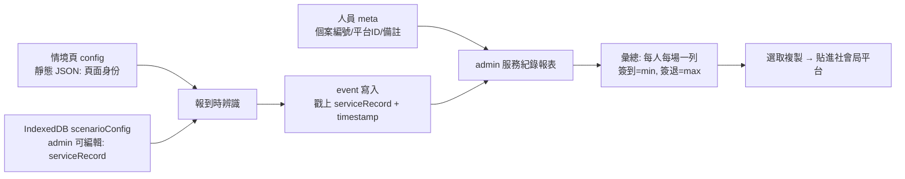

# 社會局平台 B 表對齊 Design Spec

**Goal:** 讓 facial signature 系統作為「報到自動化前端」，把報到事件產出成對齊社會局平台 B 表（簽到/服務紀錄）的清單，供管理者選取複製貼回平台；敏感 PII（身分證字號等）不進入本系統。

**Architecture:** 沿用「資料留瀏覽器」原則。情境的服務紀錄欄位（serviceRecord）從靜態 JSON 移到 IndexedDB，由 admin 編輯。報到頁載入時合併「靜態頁面身份 + IndexedDB 服務紀錄情境」，並在每筆 event 戳上當時情境。新增報表畫面把 events 依（人員, 日期, 情境）彙總成 B 表列。

**Tech Stack:** 純前端 PWA、IndexedDB（idb）、現有 face-store / admin tab 架構。無新增函式庫。

---

## § 0 系統定位（為何這樣設計）

社會局平台是 system of record。本系統只做它最擅長的一件事——**用人臉辨識自動化「插卡報到」那一步**。因此：

- **不存**身分證字號、出生年月日、行政區、里別等完整身分 PII（留在平台）
- **不做** C 表活動管理子系統（平台建活動）、D 表月報（平台自動統計）
- **只存**報到事件 + 對帳用的個案編號 + 報表所需的情境欄位

對應社會局四表：本系統聚焦產出 **B 表**；A 表只保留連結 key；C/D 表不碰。

---

## § 1 整體資料流



四個改動點：(1) config 服務紀錄情境移到 IndexedDB + admin 編輯畫面；(2) 人員加連結欄位；(3) event 戳記情境；(4) 新報表畫面彙總 + 複製。

---

## § 2 Config 儲存 + 編輯畫面

### 2.1 儲存

重用現有 `settings` store（**不改 DB schema**），記錄 id = `scenarioConfig:<scenarioId>`：

```json
{
  "id": "scenarioConfig:example-checkin",
  "scenarioId": "example-checkin",
  "serviceRecord": {
    "服務項目": "健康促進",
    "時段": "下午",
    "活動編號": "HP-115052601",
    "活動主題": "匹克球",
    "餐飲類型": "",
    "服務志工": "王小明"
  },
  "updatedAt": 1716700000000
}
```

`服務項目` 四選一：`關懷訪視` / `電話問安` / `健康促進` / `餐飲服務`。
`餐飲類型`（`共餐` / `送餐`）僅當 `服務項目 === '餐飲服務'` 時有意義。

### 2.2 職責切分

| 靜態 JSON 檔（頁面身份，少變） | IndexedDB（管理者編輯，常變） |
|---|---|
| scenarioId、scenarioName、uiTheme、trigger、tts、consentNotice、concurrency | serviceRecord：服務項目、時段、活動編號、活動主題、餐飲類型、服務志工 |

### 2.3 載入流程

報到頁（face-checkin-template）：
1. fetch 靜態 JSON → 拿頁面身份
2. 讀 IndexedDB `scenarioConfig:<scenarioId>` → 拿當前 serviceRecord
3. 若 IndexedDB 無記錄，用靜態 JSON 內的 `serviceRecord` 預設值 seed 一筆
4. 合併後使用；serviceRecord 供 § 4 戳記用

### 2.4 編輯模型

少數長期頁面，隨時更新今日活動。同一頁面跨日重複使用，活動日期自動取報到當天。管理者每天活動前更新該頁的今日主題/志工等。

### 2.5 Admin「情境設定」tab

- 列出已知情境頁（從 IndexedDB 既有 scenarioConfig 記錄 + 已知範例情境）
- 每情境一張編輯卡，欄位：服務項目（下拉）、時段、活動編號、活動主題、餐飲類型（僅餐飲服務時顯示）、服務志工
- **驗證**：服務項目＝健康促進 或 餐飲服務時，活動編號必填（平台規定健促/餐飲須先建活動才能報到）；未填擋下儲存並提示
- 「儲存」寫進 IndexedDB；報到頁下次載入生效

---

## § 3 人員連結欄位

人員 `meta` 新增兩個 key（**不改 schema**，沿用現有自由 meta 機制）：

| meta key | 用途 |
|---|---|
| `個案編號` | 自編 key（例 A001），B 表 key |
| `平台個案ID` | 平台建檔後抄回，對帳用 |

在人員 tab 的備註編輯器，比照現有「身份」做兩個專屬輸入框（避免埋在自由 key-value 打錯字）。`備註`（人員層級長期注記，例「行動不便」）沿用現有自由 meta（編輯器 datalist 已有此建議 key），不需新欄位。

未填個案編號的人員，B 表該欄留空。

---

## § 4 Event 情境戳記

報到頁（face-checkin-template）寫 event 時，把當前合併後的 `serviceRecord` 整包複製進 `event.meta.serviceRecord`。

- 每筆 event 自帶當時活動情境；日後改 config 不回頭污染舊紀錄。
- event 層級**不存備註**（備註是人員層級，見 § 3）。
- 警示模式（face-alert-template）不在本 spec 範圍——警示事件非服務紀錄，不需 serviceRecord。

---

## § 5 服務紀錄報表（B 表）

### 5.1 資料來源

`mode === 'checkin'` 且 `personId != null` 的 events（新人自動建檔、已建檔者報到皆計入；fuzzy 須審處指派 personId 後才進報表）。

### 5.2 彙總邏輯

依 **(personId, 活動日期, scenarioId, 時段)** 分組，每組 = B 表一列。把「時段」納入分組 key 確保同一天上午、下午一定拆成兩列，符合平台「上下午分開登打」硬要求：

| B 表欄位 | 來源 |
|---|---|
| 流水號 | 報表內自動流水 1, 2, 3… |
| 活動日期 | 該組日期，民國年 `115/05/26` |
| 星期 | 自動推算（週一…週日） |
| 時段 | 該組任一 event 的 `meta.serviceRecord.時段` |
| 服務項目 | `meta.serviceRecord.服務項目` |
| 活動編號 | `meta.serviceRecord.活動編號` |
| 活動主題 | `meta.serviceRecord.活動主題` |
| 餐飲類型 | `meta.serviceRecord.餐飲類型` |
| 個案編號 | person.meta['個案編號'] |
| 姓名 | person.displayName |
| 簽到時間 | 該組 `min(timestamp)`，格式 `hh:mm` |
| 簽退時間 | 該組 `max(timestamp)`，格式 `hh:mm` |
| 報到方式 | 固定字串「人工補登」（對齊平台 enum；本系統代為產生再貼回，視為人工補登） |
| 是否平台已登錄 | 留空（平台人工補） |
| 血壓收縮 | 留空（刻意不捕捉，見 §6） |
| 血壓舒張 | 留空（刻意不捕捉，見 §6） |
| 服務志工 | `meta.serviceRecord.服務志工` |
| 備註 | person.meta['備註'] |

**欄位順序完全照 B 表排**，未捕捉欄位留空白欄，確保整張貼進平台對得齊。

### 5.3 篩選

- 活動日期區間（起～迄）
- 情境（scenarioId）

### 5.4 畫面（admin「服務紀錄報表」tab）

- 渲染 HTML `<table>`，欄位如 5.2
- 民國年日期、中文星期、`hh:mm` 時間
- 可直接框選複製整張貼進社會局平台
- 篩選列在表格上方
- **資料品質提示**：個案編號空白的列標紅（該列貼回平台無法對應 A 表個案），提醒管理者先去人員 tab 補個案編號

---

## § 6 不做的部分（YAGNI）

- C 表活動管理子系統（師資/場地/預計人數）——平台建活動
- D 表月報自動統計——平台自動算
- 身分證字號、出生年月日、性別、聯絡電話、行政區、里別、同意書簽署日等完整 PII——留在平台 A 表
- 組別、首次參與日——屬平台 A 表營運欄位，不在本系統管
- 血壓（收縮/舒張）——浮動健康量測值，不在報到流程捕捉，B 表留空欄由平台人工補
- 是否平台已登錄——本地不追蹤，留空欄（v2 再評估是否加已複製標記）
- 簽退專屬機制（離開再辨識）——簽退＝最後一次辨識時間，自動推算
- 檔案匯出（CSV/xlsx）——採選取複製，不出檔
- 報到方式多選——固定「人工補登」（對齊平台 enum）

---

## § 7 影響的檔案（概覽）

| 檔案 | 動作 |
|---|---|
| `shared/face-store-config.js` | 新增：scenarioConfig 的讀寫（用 settings store） |
| `shared/face-checkin-template.js` | 載入時合併 IndexedDB config；寫 event 戳 serviceRecord |
| `shared/admin/admin-tab-config.js` | 新增：情境設定 tab |
| `shared/admin/admin-tab-report.js` | 新增：服務紀錄報表 tab |
| `shared/admin/admin-tab-people.js` | 人員 meta 編輯器加個案編號、平台個案 ID 專屬欄位 |
| `admin.html` | 加兩個 tab 按鈕（情境設定、服務紀錄報表） |
| `configs/example-checkin.json` | 加 serviceRecord 預設值（seed 用） |
| `service-worker.js` | bump VERSION + 加入新檔到 APP_SHELL |

DB schema 不變（重用 settings store + person.meta + event.meta）。

---

## § 8 Scope

本 spec 為單一 feature（產出 B 表）。實作計劃時可拆兩段：(1) 資料捕捉（config 儲存+編輯、人員欄位、event 戳記）；(2) 報表畫面（彙總+渲染+複製）。第二段依賴第一段的資料。
